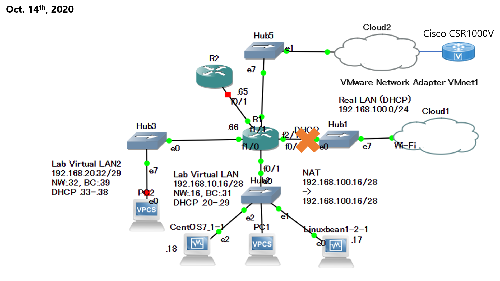

# Linux_NW_Lab
Network lab for GNS3

## Network Diagram


* To Internet
  + Internet can be access via VMware network adapter. use VMware to create VM, ```Cisco CSR 1000V```, and connect via VMware network adapter
    + [GNS3] device in ```Lab Virtual LAN``` === Hub cisco router ```R1``` === ```VMware network adapter``` ===> [VMware]
    + [VMware] ```VMware network adapter``` === cisco router VM ```Cisco CSR 1000V``` ===> [internet]
  + ```Cisco CSR 1000V``` has two adapters:
    + Adapter1 (```GigabitEthernet1```): Bridge adapter to connect Host OS Wireless network adapter,
    + Adapter2 (```GigabitEthernet2```): VMware network adapter to connect device in GNS3.
  + Since WMware automatically generates "VMware network adapter", cloud function of GNS3 can use it, and then, device in GNS3 and ```Cisco CSR 1000V``` in VMware can be connected each other. 
  + ```Cisco CSR 1000V``` apply static NAT, and the device in ```Lab Virtual LAN``` can access to internet. 
